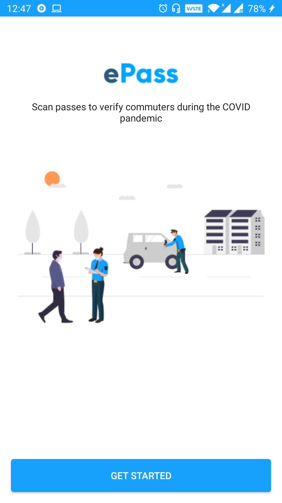
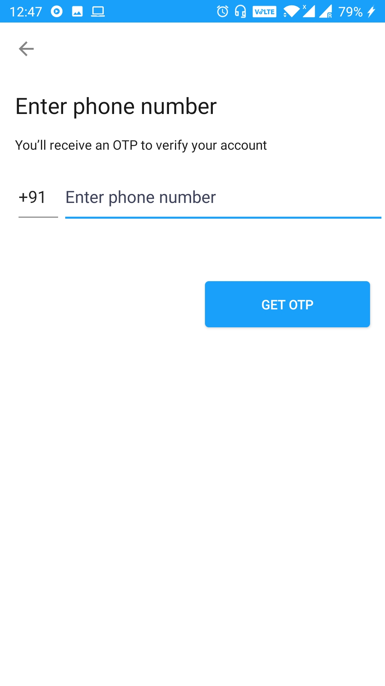
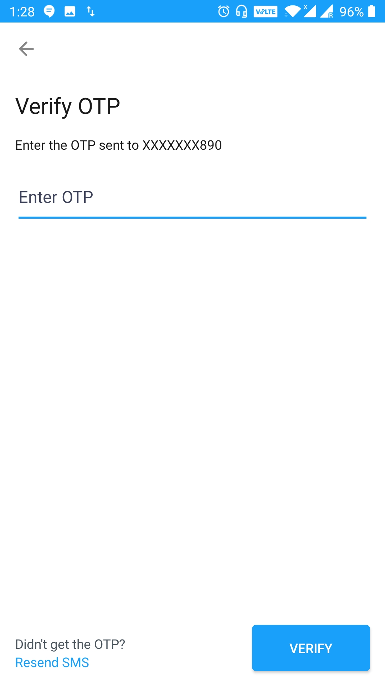
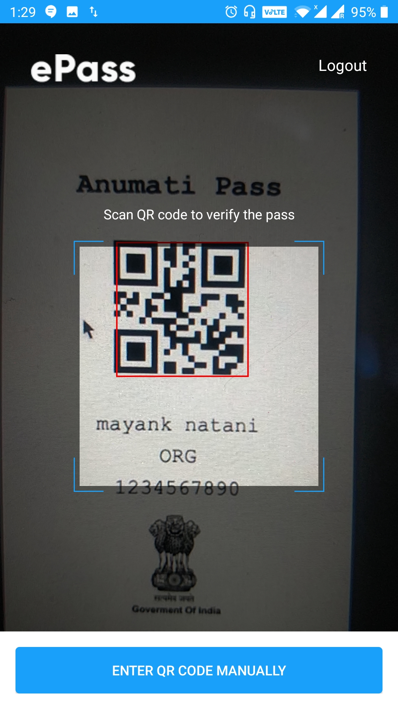
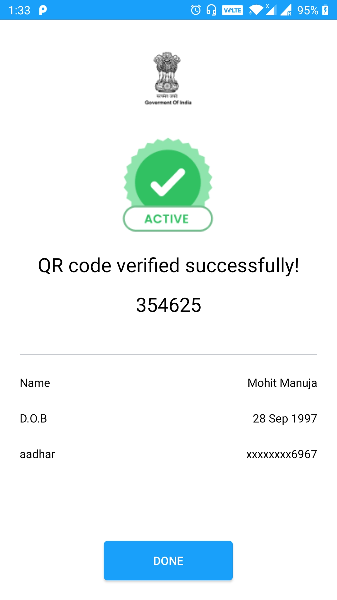

# ePass Android Approver App

e-passes are gaining popularity in the current time. It can be used by one agency to offer passes as an approval to allow some privileges.  
One example use case is that Govts using this to provide e-Passes to come out during the lockdown period.
This app can be used by the providers to validate the legitimacy of passes.

## Screenshots

  
  
  
  
  

## Features

* You can scan the QR Code using your phone camera. (Requires Camera Permission)
* You can also validate the QR Code manually.

## How to Contribute
This is an Open Source project and we would be happy to see contributors who report bugs and file feature requests by submitting pull requests as well.

## Development Setup

Before you begin, you should have already downloaded the Android Studio SDK and set it up correctly. You can find a guide on how to do this here: [Setting up Android Studio](http://developer.android.com/sdk/installing/index.html?pkg=studio)

### Setting up the Android Project

1. Download the *ePass Approver App* project source. You can do this either by forking and cloning the repository (recommended if you plan on pushing changes) or by downloading it as a ZIP file and extracting it.

2. Open Android Studio, you will see a **Welcome to Android** window. Under Quick Start, select *Import Project (Eclipse ADT, Gradle, etc.)*

4. Navigate to the directory where you saved the ePass Android Approver-android project, select the root folder of the project (the folder named "ePass Android Approver"), and hit OK. Android Studio should now begin building the project with Gradle.

5. Once this process is complete and Android Studio opens, change "google_service.json" with your firebase config file to track Firebase feature i.e Crashlytics, Analytics, etc.

5. Redirect to CommonConfig to make generic changes i.e API Endpoints and OTP Length.